# Dockerized Application Platform (Terraform, Ansible & Docker)


---

# Project Overview

The Dockerized Application Platform automates the provisioning and configuration of containerized infrastructure on AWS. Using Terraform for infrastructure provisioning and Ansible for configuration management, the platform deploys a multi-container application stack consisting of Nginx, Flask, and PostgreSQL using Docker and Docker Compose.

The project demonstrates how Infrastructure as Code, Configuration Management, and Containerisation can be combined to create a repeatable and automated deployment workflow.

---

# Architecture


---

# Deployment Workflow

```text
Developer
    ↓
Terraform Apply
    ↓
AWS Infrastructure Provisioned
(VPC, Subnet, Security Groups, EC2)
    ↓
Ansible Playbook Execution
    ↓
Docker Engine Installed
Application Files Deployed
    ↓
Docker Compose Up
    ↓
Nginx → Flask → PostgreSQL Running
```

# Infrastructure Overview

* VPC
* Public Subnet
* Internet Gateway
* Route Table
* Admin Security Group (SSH :22)
* Application Security Group (HTTP :80, SSH from Admin Server)
* EC2 Admin Server (t3.micro) — Ansible Control Node
* EC2 Application Server (t3.small) — Docker Host

---

# Service Exposure Model

| Service    | Port | Access                  |
| ---------- | ---- | ----------------------- |
| SSH        | 22   | Admin Server Only       |
| Nginx      | 80   | Internet                |
| Flask      | 5000 | Internal Docker Network |
| PostgreSQL | 5432 | Internal Docker Network |

Only Nginx is publicly accessible. Flask and PostgreSQL communicate exclusively through the Docker network and are not exposed directly to the internet.

---

# Engineering Decisions

## Infrastructure Provisioning with Terraform

Terraform provisions AWS infrastructure through declarative configuration files, enabling version-controlled and repeatable deployments. Infrastructure components are organised into reusable modules to improve maintainability and scalability.

## Configuration Management with Ansible

Ansible automates all post-provisioning server configuration tasks including Docker installation, application deployment, and operating system configuration. This separation ensures clear responsibility boundaries between infrastructure provisioning and server configuration.

## Container Orchestration with Docker Compose

Docker Compose manages the multi-container application stack declaratively. Service dependencies ensure PostgreSQL becomes available before Flask starts, and Flask becomes available before Nginx begins serving requests.

## Nginx as Reverse Proxy

Nginx serves as the single public entry point to the application. All inbound traffic is routed through Nginx before reaching the Flask backend. This prevents direct access to internal application components.

## Persistent Database Storage

PostgreSQL data is stored in a named Docker volume, ensuring application data survives container restarts and re-deployments.

## Ansible Role Separation

Ansible roles follow a single-responsibility design:

* common
* users
* security
* docker
* application

This improves maintainability and promotes role reuse across future projects.

---


# Project Execution

## Phase 1: Infrastructure Provisioning

Provisioned the AWS networking and compute layer using Terraform.

### Activities

* Terraform initialization
* VPC deployment
* Public subnet deployment
* Route table configuration
* Security group configuration
* EC2 instance deployment

### Validation

```bash
terraform plan
```

```bash
terraform apply
```
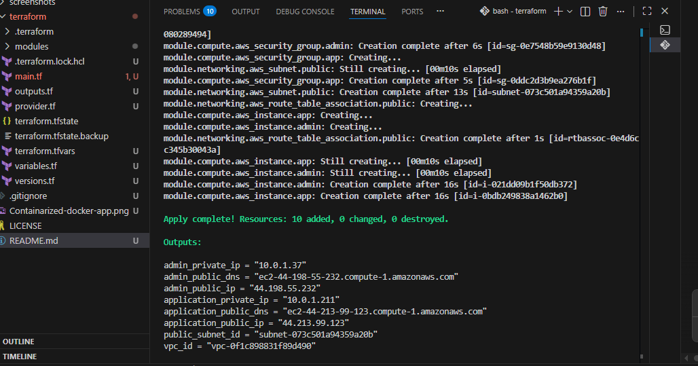

Infrastructure provisioned successfully.


---

## Phase 2: Docker Installation

Installed and configured Docker Engine using Ansible.

### Activities

* Added Docker repository
* Installed Docker Engine
* Installed Docker Compose Plugin
* Started Docker service
* Enabled Docker service
* Added application user to docker group

### Validation

Verify Ansible connectivity.

```bash
ansible all -m ping
```

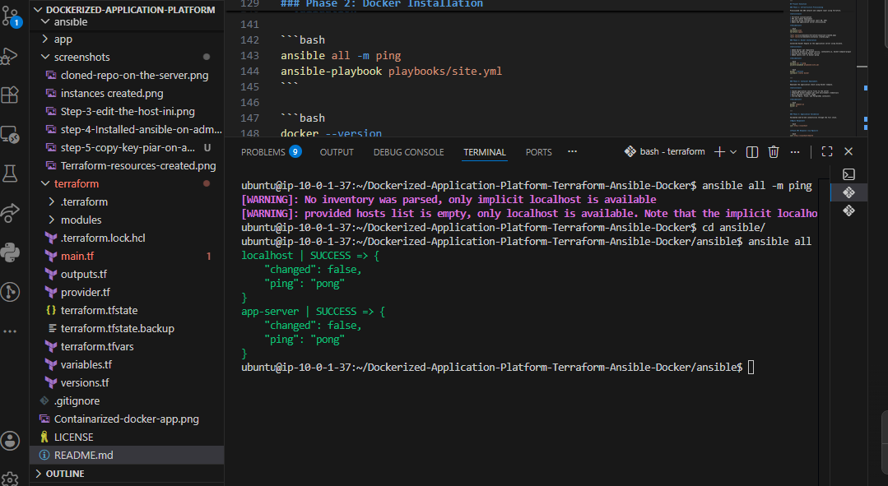

Execute the platform playbook.

```bash
ansible-playbook playbooks/site.yml
```

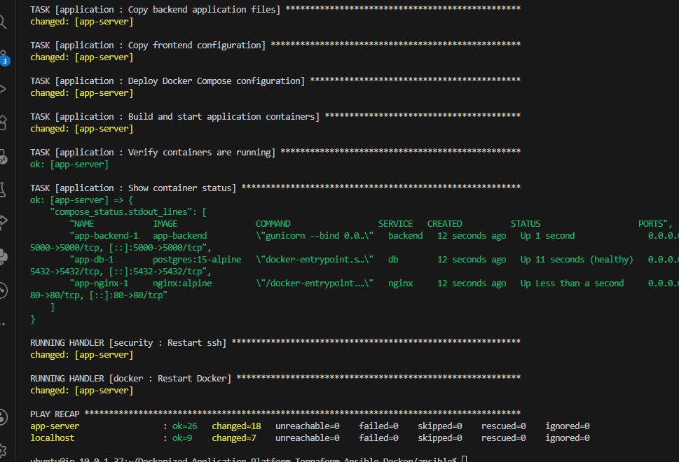


Verify Docker installation.

```bash
docker --version
docker compose version
systemctl status docker
```

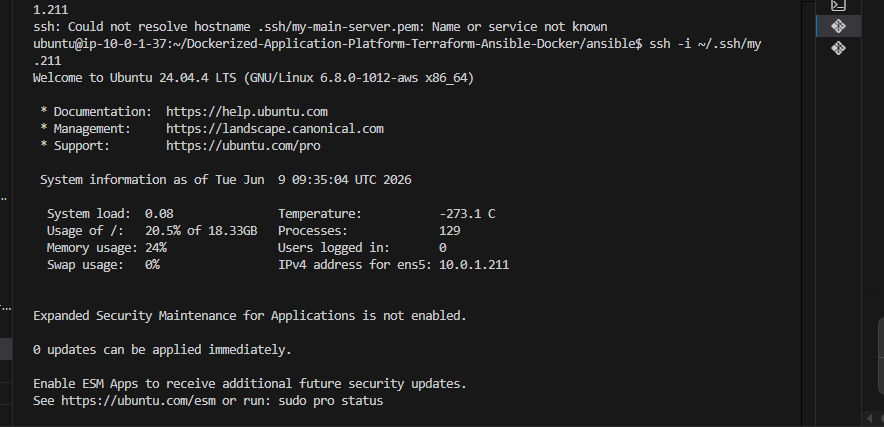

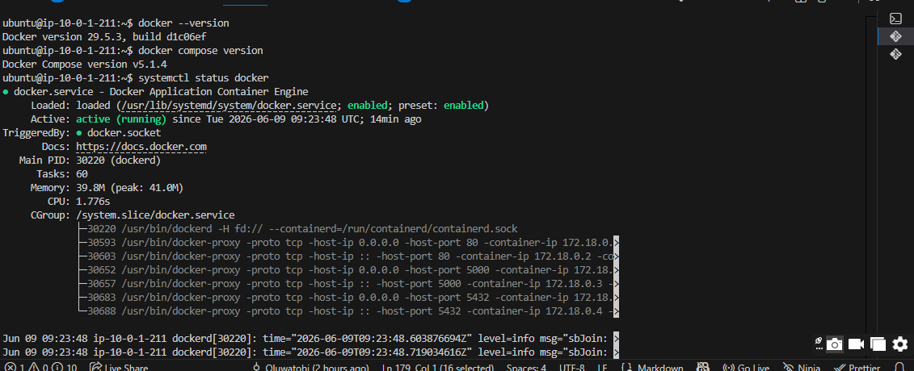

---

## Phase 3: Container Deployment

Deployed the application stack using Docker Compose.

### Activities

* Copied application source files
* Generated Docker Compose configuration
* Built Flask application image
* Started Nginx container
* Started Flask container
* Started PostgreSQL container

### Validation

```bash
docker compose -f /opt/app/docker-compose.yml ps

```
```bash
docker ps
```
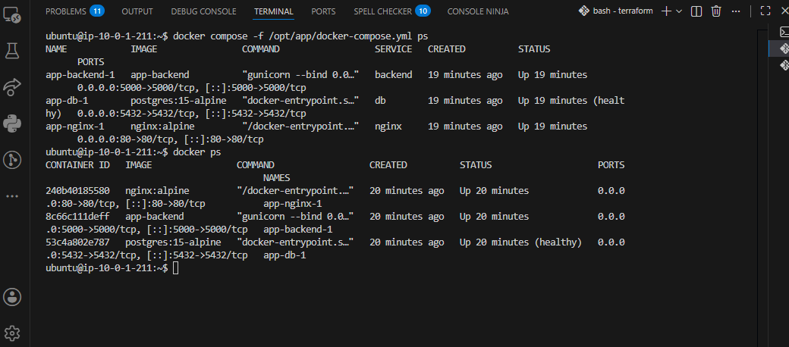


## Phase 4: Application Validation

Validated end-to-end connectivity through the application stack.

### Validation

Verify Nginx response.

```bash
curl http://localhost
```
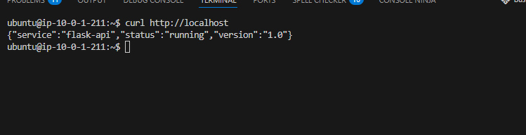

Verify Flask health endpoint.

```bash
curl http://localhost/health
```
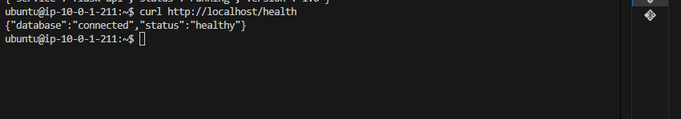

Verify API status endpoint.

```bash
curl http://localhost/api/status
```


Verify PostgreSQL connectivity.

```bash
docker exec -it <db-container> psql -U appuser -d appdb -c "\l"
```
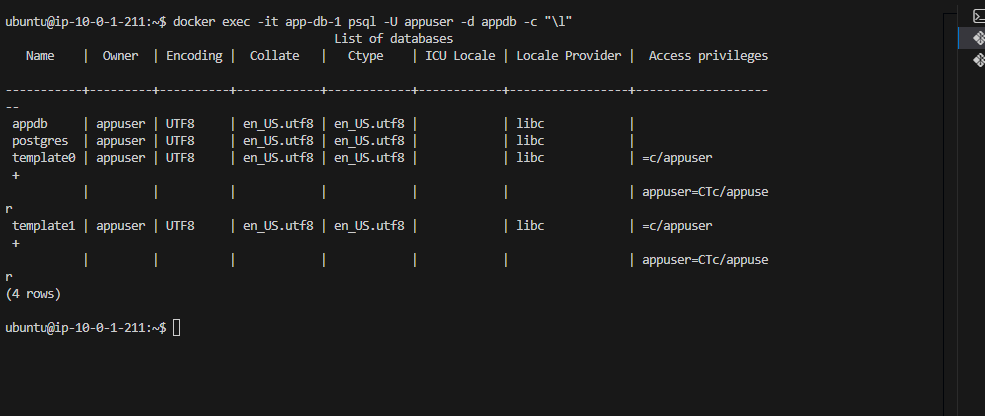


## Phase 5: Security and Operations

Validated platform security and operational readiness.

### Docker Service Persistence

```bash
systemctl status docker
systemctl is-enabled docker
```


### Container Health Validation

```bash
docker compose ps
```

```bash
docker inspect <container-name> --format='{{.State.Health.Status}}'
```

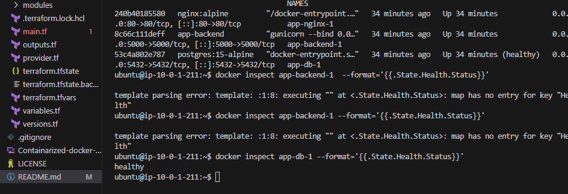

### SSH Hardening Validation

```bash
sudo grep PermitRootLogin /etc/ssh/sshd_config
sudo grep PasswordAuthentication /etc/ssh/sshd_config
```


## Phase 6: External Access Validation

Validated application accessibility through the public endpoint.

```bash
curl http://<application-public-ip>
```

or access through a web browser.

 http://<application-public-ip>


* Successful application response through the public IP

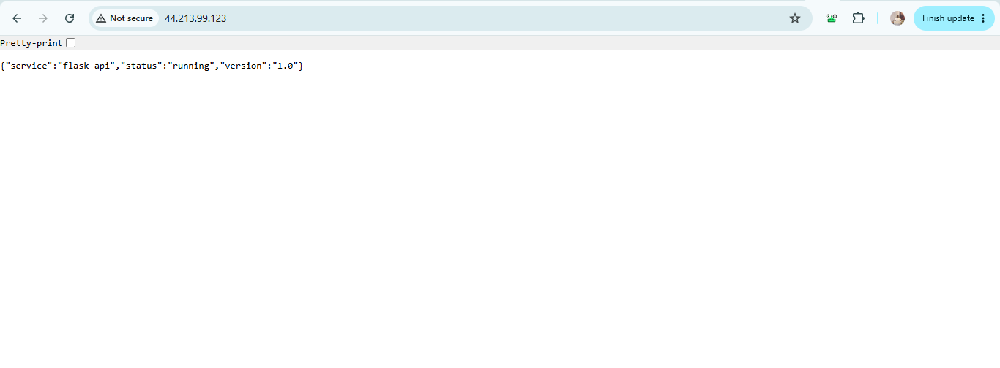


# Key Concepts Demonstrated

* Infrastructure as Code (IaC)
* Configuration Management
* Containerisation
* Multi-Container Application Deployment
* Docker Compose
* Container Networking
* Reverse Proxy Configuration
* Persistent Storage with Docker Volumes
* Service Health Checks
* Ansible Templating with Jinja2
* Linux Administration
* Security Hardening
* Modular Infrastructure Design
* Separation of Infrastructure and Configuration

---


# Author

## Oluwatobi Ogundimu

GitHub: https://github.com/iampryce

LinkedIn: https://www.linkedin.com/in/oluwatobi-ogundimu-a1341a39b/
