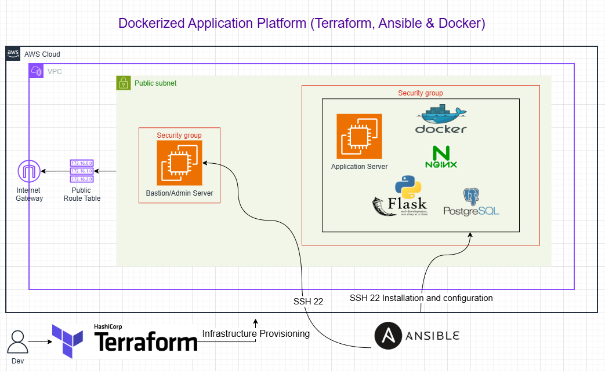

# Dockerized Application Platform (Terraform, Ansible & Docker)

        

---

## Project Overview

The Dockerized Application Platform automates the provisioning and configuration of containerized application infrastructure on AWS. Using Terraform for infrastructure provisioning and Ansible for configuration management, the platform deploys a multi-container application stack comprising Nginx, Flask, and PostgreSQL through Docker and Docker Compose.

---

## Architecture



---

## Deployment Workflow

```text
Developer
    ↓
Terraform Apply
    ↓
AWS Infrastructure Provisioned
(VPC, Subnet, Security Groups, EC2)
    ↓
Ansible Playbook Execution
    ↓
Docker Engine Installed
Application Files Deployed
    ↓
Docker Compose Up
    ↓
Nginx → Flask → PostgreSQL Running
```

---

## Objectives

* Provision AWS infrastructure using Terraform modules
* Automate Docker Engine installation using Ansible
* Deploy a multi-container application stack using Docker Compose
* Implement container networking between services
* Persist database data using Docker named volumes
* Validate the full application stack end-to-end

---

## Infrastructure Overview

* VPC
* Public Subnet
* Internet Gateway
* Route Table
* Admin Security Group (SSH :22)
* Application Security Group (HTTP :80, SSH from Admin)
* EC2 Admin Server (t3.micro) — Ansible control node
* EC2 Application Server (t3.small) — Docker host

---

## Engineering Decisions

### Infrastructure Provisioning with Terraform

Terraform provisions all AWS resources through declarative configuration files, enabling version-controlled and repeatable deployments. Infrastructure is organized into reusable modules for networking and compute, keeping each concern isolated and independently maintainable.

### Configuration Management with Ansible

Ansible automates everything that happens after the servers exist: Docker installation, application file deployment, and container lifecycle management. Separating infrastructure provisioning from server configuration keeps each tool in its area of responsibility.

### Container Orchestration with Docker Compose

Docker Compose manages the multi-container application stack declaratively. Service dependencies are enforced at startup — Nginx waits for the backend, and the backend waits for PostgreSQL to pass its health check before accepting connections.

### Nginx as Reverse Proxy

Nginx is the only publicly exposed service, listening on port 80. All incoming traffic passes through Nginx before reaching Flask. Flask and PostgreSQL are accessible only within the Docker network — they are not reachable from the internet.

### Persistent Database Storage

PostgreSQL data is stored in a named Docker volume. Container restarts and re-deployments do not affect stored data.

### Ansible Role Separation

Roles are kept single-purpose: `docker` installs and configures the Docker Engine, `application` handles application deployment. This makes each role independently testable and reusable.

---

## Implementation Highlights

* Provisioned AWS infrastructure through reusable Terraform modules
* Configured security groups to expose only port 80 — Flask and PostgreSQL are internal only
* Automated Docker Engine installation using the official Docker apt repository
* Deployed application files and configuration using Ansible copy and template tasks
* Used a Jinja2 template for Docker Compose to support environment-specific credentials
* Implemented service dependency ordering with Docker Compose health checks
* Configured Nginx as a reverse proxy — sole entry point for all application traffic
* Persisted PostgreSQL data through a named Docker volume

---

## Project Execution

### Phase 1: Infrastructure Provisioning

Provisioned the AWS network and compute layer using Terraform.

**Activities**

* Terraform initialization
* VPC and subnet deployment
* Security group configuration (port 80, SSH)
* Admin and application server provisioning

**Validation**

```bash
terraform plan
terraform apply
```


### Phase 2: Docker Installation

Installed Docker Engine on the application server using Ansible.

**Activities**

* Added Docker apt repository
* Installed docker-ce, docker-ce-cli, containerd.io, docker-compose-plugin
* Started and enabled Docker service
* Added ubuntu user to docker group

**Validation**

```bash
ansible all -m ping
ansible-playbook playbooks/site.yml
```

```bash
docker --version
systemctl status docker
```

---

### Phase 3: Container Deployment

Deployed the application stack using Docker Compose.

**Activities**

* Copied application source files to the server
* Templated docker-compose.yml with environment credentials
* Built backend container image
* Started Nginx, Flask, and PostgreSQL containers

**Validation**

```bash
docker compose ps
docker ps
```

---

### Phase 4: Application Validation

Validated end-to-end connectivity through the full stack.

**Nginx Response**

```bash
curl http://localhost
```

**Flask API Response (via Nginx)**

```bash
curl http://localhost/health
curl http://localhost/api/status
```

**PostgreSQL Validation**

```bash
docker exec -it <db-container> psql -U appuser -d appdb -c "\l"
```

---

### Phase 5: Security and Operations

Validated service persistence and container health.

**Docker Service Persistence**

```bash
systemctl status docker
systemctl is-enabled docker
```

**Container Health Validation**

```bash
docker compose ps
docker inspect <container-name> --format='{{.State.Health.Status}}'
```

**SSH Hardening Validation**

```bash
sudo grep PermitRootLogin /etc/ssh/sshd_config
sudo grep PasswordAuthentication /etc/ssh/sshd_config
```

---

## Validation Summary

✔ Infrastructure deployed successfully

✔ Docker Engine installed and running

✔ Application containers started

✔ Nginx proxying traffic to Flask backend

✔ Flask API responding through Nginx on port 80

✔ PostgreSQL accepting connections

✔ Named volume persisting database data

✔ SSH hardening applied

---

## Key Concepts Demonstrated

* Infrastructure as Code (IaC)
* Configuration Management
* Containerisation
* Multi-container Application Deployment
* Container Networking
* Reverse Proxy Configuration
* Persistent Storage with Docker Volumes
* Service Health Checks
* Ansible Templating with Jinja2
* Modular Infrastructure Design
* Separation of Infrastructure and Configuration

---

## Future Enhancements

* CI/CD pipeline with GitHub Actions — automate image builds and deployments on code push
* Container image registry with Amazon ECR — store versioned images instead of building on the server
* SSL/TLS termination at Nginx — HTTPS with Let's Encrypt or ACM certificates
* Kubernetes migration — move from Docker Compose to EKS for scalability and self-healing
* Environment separation — staging and production configurations with separate Terraform workspaces

---

## Author

### Oluwatobi Ogundimu

GitHub: https://github.com/iampryce

LinkedIn: https://www.linkedin.com/in/oluwatobi-ogundimu-a1341a39b/
